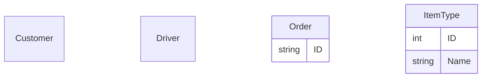

- Order assignment to driver
  - Order should have some location param, driver location param
  - Based on this the driver can choose from a bunch of orders
  - Either allow the driver to choose the order
  - Or auto-assign
    - But driver needs to accept in this case
  - do not complicate, auto-assign to driver


### OrderState
- Placed
- Assigned
- PickedUp
- Delivered
- Canceled

### DriverState
- Free
- Assigned
- PickedUp

### FlowChart
```mermaid
flowchart

```


## DB Schema



## Assignment Algorithm
OrderQueue
FreeDriverList
